
<h1 align="center">宠物领养平台</h1>

## 简介
宠物领养平台：角色分为管理员、用户；提供领养服务、用户管理、宠物信息管理、论坛交流、新闻资讯等功能，实现便捷的互动体验和高效的信息管理。    --计算机毕业设计源码；毕设源码；java毕业设计源码

## 联系方式

<h3 align="center">获取完整代码与数据库文件 + 微信：deepguan QQ: 86050149 QQ群: 783742310</h3>

<h3 align="center">可帮忙远程部署 包运行成功！提供远程部署、修改代码、设计文档指导、代码讲解等服务！</h3>

## 功能介绍（完整见运行截图）
管理员：主要功能包括管理用户信息和宠物信息，支持用户搜索、新增、修改和删除操作。可以管理论坛帖子与轮播图项目，并查看、修改、删除新闻资讯。支持宠物领养订单的查询和管理，并具备管理员登录与退出功能。 用户：可以浏览宠物百科和新闻信息，查看待领养的宠物详细信息，包括宠物的名字、类型及申请状态，并可以申请领养或取消申请。用户个人中心允许查看和修改个人信息，管理个人头像，以及修改密码和退出登录功能。 帖子作者：论坛发布界面支持撰写帖子内容，使用文本编辑器进行文字格式化和插入图片，发布后可以在论坛与其他用户互动。 数据录入人员：在后台管理中可以录入和管理宠物信息，输入宠物名称、照片、编号、地点和类型，并通过文本编辑器详细介绍宠物。

## 运行截图

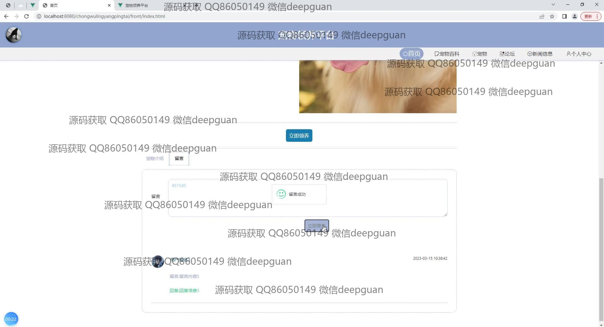
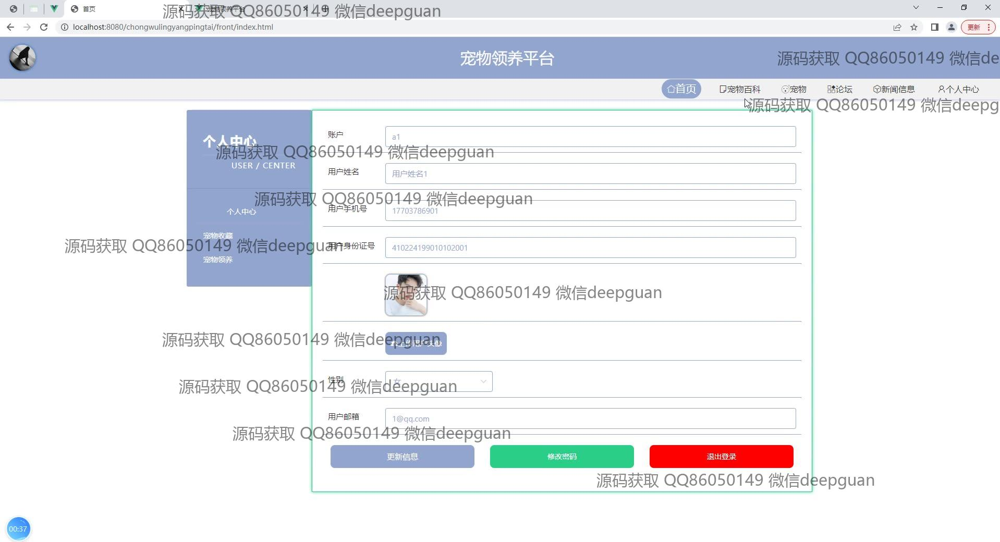
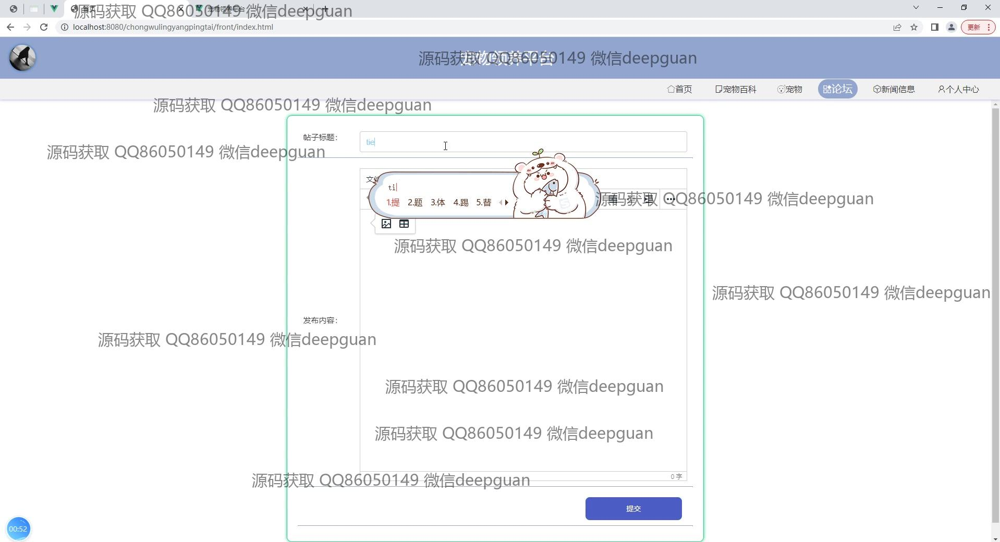
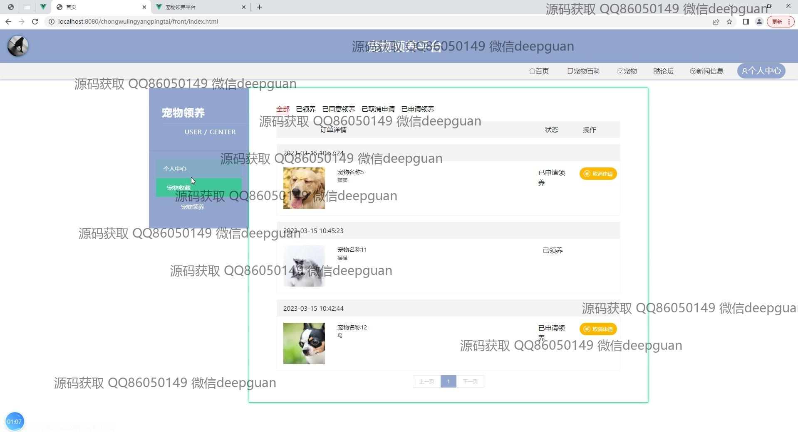
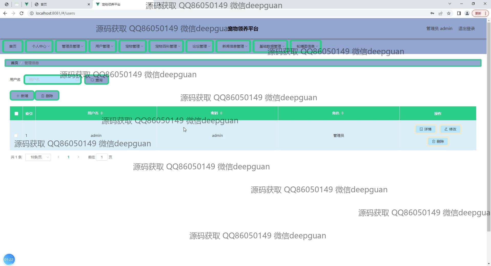
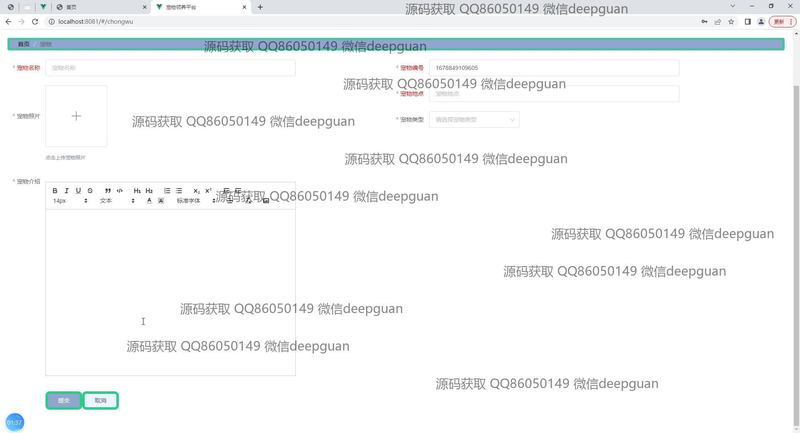
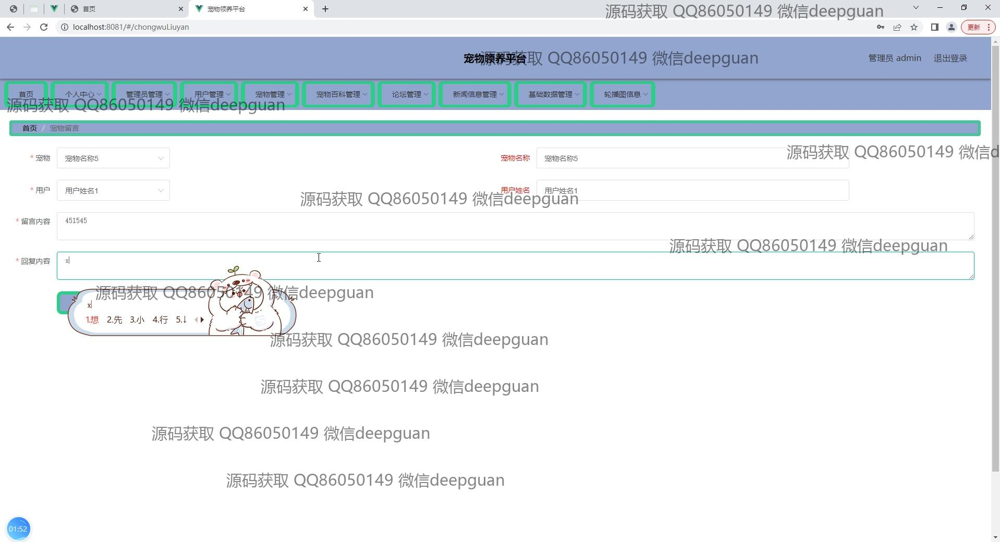
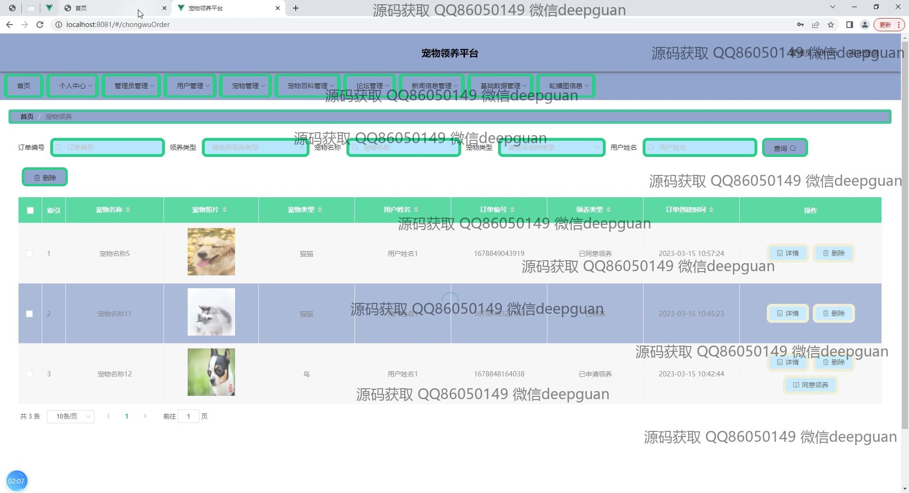
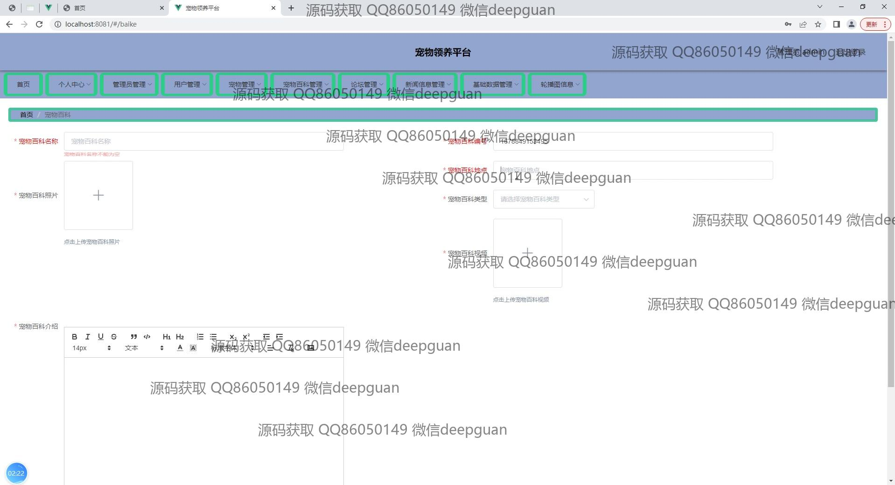
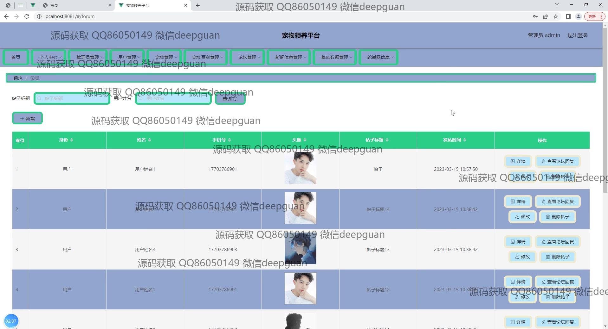
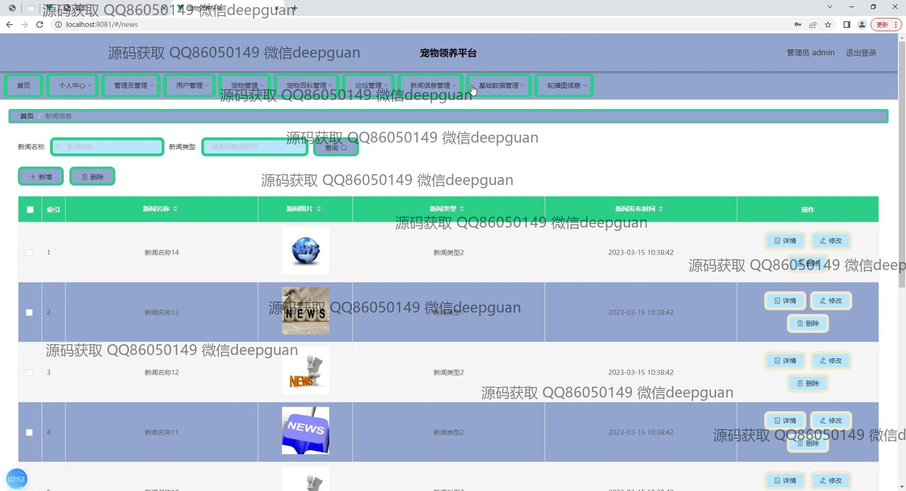
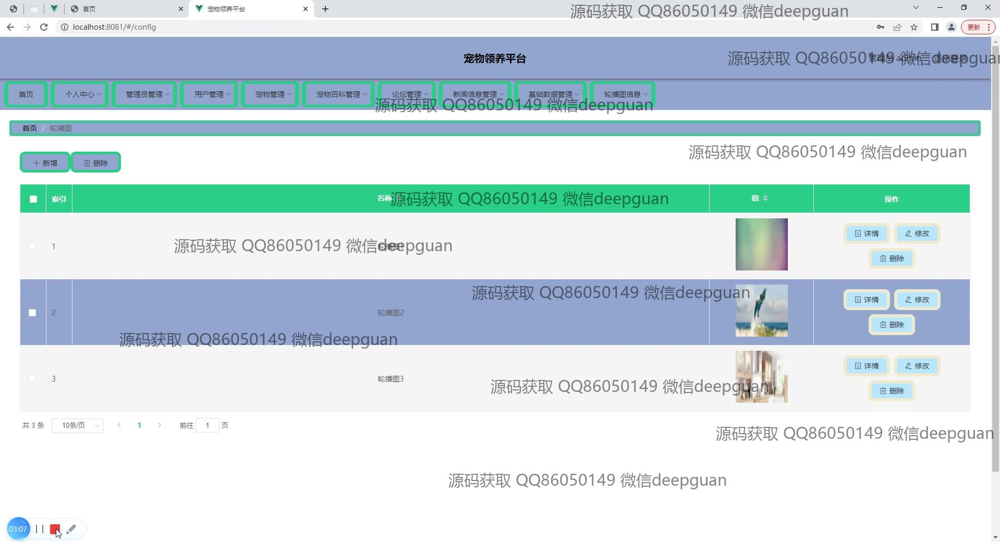

本代码来源于网络,仅供学习参考使用!

